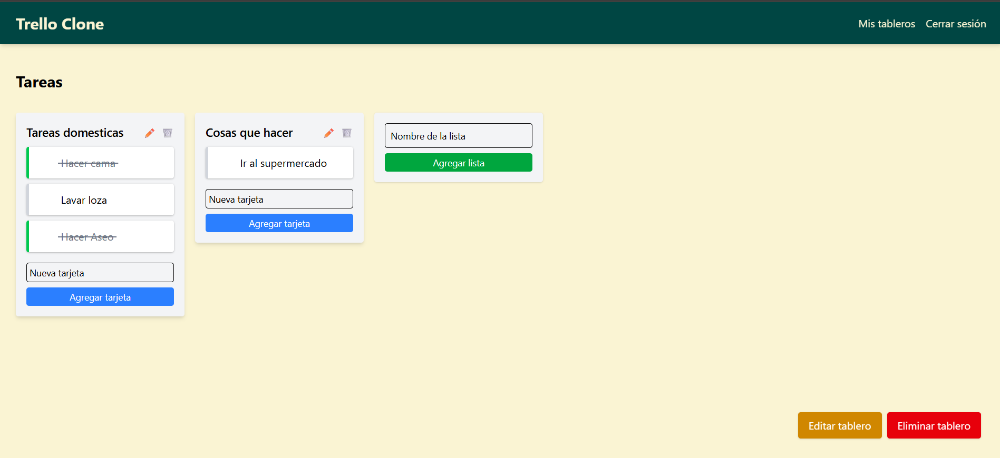

# 📋 Trello Clone / Organizador de Tareas

Aplicación tipo Trello para organizar tareas mediante tableros.
Permite a los usuarios:

- Registrarse / Iniciar sesión
- Crear, ver y gestionar tableros, listas y tareas

---

## 🚀 Demo
🔗 [Ver aplicación desplegada](https://organizador-tareas-frontend.onrender.com/login) 

---

## 📸 Vista previa


---

## 🛠️ Tecnologías utilizadas
- Angular
- Node.js + Express
- PostgreSQL
- Autenticación con JWT
- Tailwind

  ---

  ## ⚙️ Instalación y uso
1. Clona el repositorio:  
   ```bash
   git clone https://github.com/craguila14/organizador_tareas.git
   cd organizador_tareas
2. Instala las dependencias del frontend
   ```bash
   cd frontend
   npm install
3. Instala las dependencias del backend
   ```bash
   cd backend
   npm install
4. Configura las variables de entorno en el backend (crea un archivo .env)
    DB_USER, DB_PASSWORD, DB_HOST, DB_PORT, DB_DATABASE, JWT_SECRET
5. Inicia el servidor del front
   ```bash
   ng serve
6. Inicia el servidor del backend
   ```bash
   npm run start
